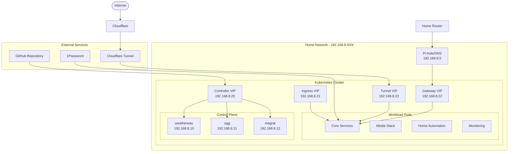
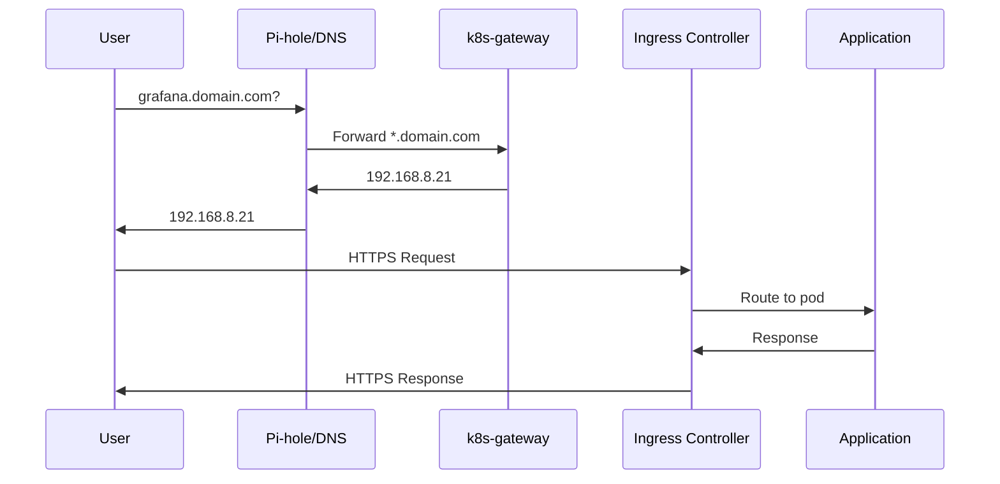
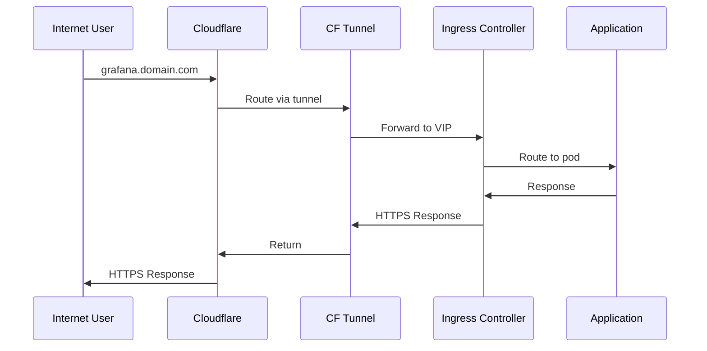
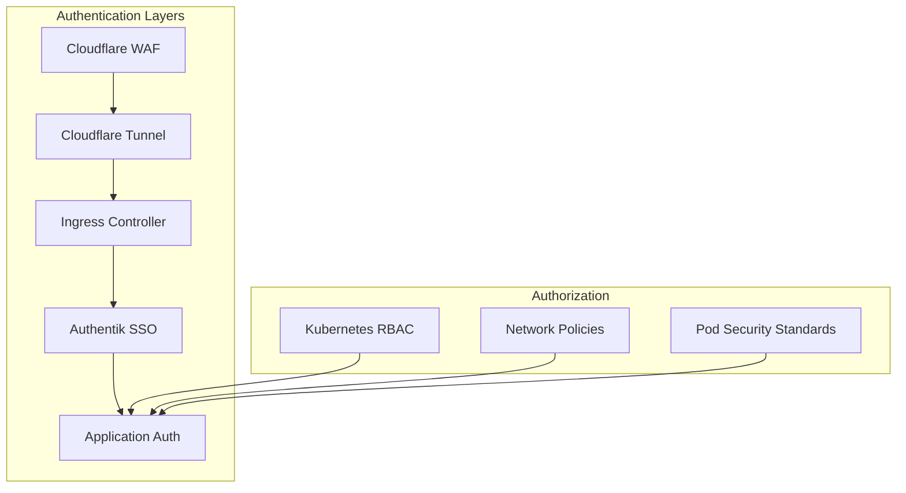
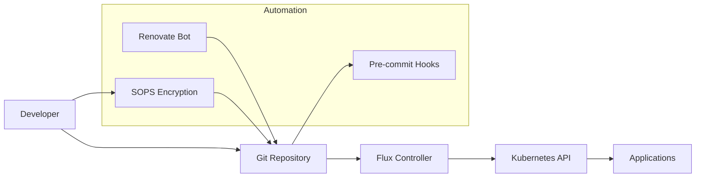

# 🏛 System Architecture Overview

Understanding the overall architecture of your Kubernetes homelab helps with troubleshooting, scaling, and making informed decisions about changes and additions.

## 🎯 High-Level Architecture



## 🧱 Core Components

### Operating System Layer

#### Talos Linux

- Immutable, API-driven Kubernetes OS
- No SSH access - all management via API
- Minimal attack surface
- Automatic security updates
- Container-focused design

**Benefits:**

- Consistent, reproducible nodes
- Reduced operational overhead
- Enhanced security posture
- Simplified cluster management

### Container Runtime

#### Containerd + Cilium

- Containerd: Container runtime interface
- Cilium: eBPF-based networking and security
- Replaces kube-proxy with eBPF
- Network policies and observability

### Control Plane (HA)

#### 3-Node Etcd Cluster

- Distributed key-value store
- Consensus-based replication
- Automatic leader election
- Backup and restore capabilities

#### API Server Load Balancing

- VIP: 192.168.8.20
- Automatic failover between nodes
- External access for kubectl/Flux

## 🌐 Networking Architecture

### Network Segmentation

```yaml
# Network Layout
Home Network: 192.168.1.0/24    # Main home devices
Cluster Network: 192.168.8.0/24  # Kubernetes infrastructure
Pod Network: 10.69.0.0/16        # Pod-to-pod communication
Service Network: 10.96.0.0/16    # Kubernetes services

# VIP Allocation
Controller VIP: 192.168.8.20     # Kubernetes API
Ingress VIP: 192.168.8.21        # HTTP/HTTPS traffic
Gateway VIP: 192.168.8.22        # Internal DNS resolution
Tunnel VIP: 192.168.8.23         # Cloudflare tunnel
```

### Traffic Flow Patterns

#### Internal Access (Home Network)



#### External Access (Internet)



### Load Balancing Strategy

#### MetalLB (L2 Mode)

- Announces VIP addresses via ARP
- Simple setup for home networks
- Single point of failure (by design)
- Automatic failover between nodes

## 🔐 Security Architecture

### Authentication & Authorization

#### Multi-Layer Security



#### Identity Management

- **Authentik**: Central SSO provider
- **1Password**: Secret management
- **RBAC**: Kubernetes role-based access
- **Network Policies**: Micro-segmentation

### Secret Management

#### SOPS + Age Encryption

- Secrets encrypted at rest in Git
- Age key for decryption
- Automatic deployment via Flux
- 1Password integration for runtime secrets

#### External Secrets Operator

- Fetches secrets from 1Password
- Creates Kubernetes secrets automatically
- Rotation and lifecycle management
- Multiple vault support

## 📊 Data Architecture

### Storage Strategy

#### System Storage

```yaml
# Per-node storage
System Disk: 500GB NVMe SSD
- OS: ~10GB (Talos)
- Container Images: ~50GB
- Container Runtime: ~20GB
- Kubernetes: ~10GB
- Available: ~400GB for PVs
```

#### Persistent Volume Strategy

#### OpenEBS LocalPV

- Hostpath-based storage
- Local SSD performance
- No replication (application-level backups)
- Dynamic provisioning

**Volume Types:**

- **Config volumes**: 1-10GB for configuration
- **Database volumes**: 10-100GB for application data
- **Media volumes**: 100GB-1TB for media files
- **Log volumes**: 10-50GB for centralized logging

### Backup Architecture

#### Volsync + External Storage

- Snapshot-based backups
- Rsync to external storage
- Automated scheduling
- Retention policies

## 🔄 GitOps Workflow

### Continuous Deployment Pipeline



### Configuration Management

#### Template-Driven Configuration

- Jinja2 templates in `bootstrap/templates/`
- Central configuration in `config.yaml`
- Generated manifests in `kubernetes/`
- Encrypted secrets with SOPS

#### Flux Reconciliation

- Git source monitoring
- Kustomization building
- Helm release management
- Health checking and alerting

## 📈 Observability Architecture

### Monitoring Stack

```mermaid
graph TB
    subgraph "Collection"
        NodeExp[Node Exporter]
        KubeState[kube-state-metrics]
        AppMetrics[Application Metrics]
        Logs[Container Logs]
    end

    subgraph "Storage & Processing"
        Prometheus[Prometheus]
        Loki[Loki (optional)]
    end

    subgraph "Visualization & Alerting"
        Grafana[Grafana]
        AlertManager[AlertManager]
        Gatus[Gatus]
    end

    NodeExp --> Prometheus
    KubeState --> Prometheus
    AppMetrics --> Prometheus
    Logs --> Loki

    Prometheus --> Grafana
    Prometheus --> AlertManager
    Loki --> Grafana
```

### Key Metrics

**Infrastructure Metrics:**

- Node resource utilization (CPU, memory, disk)
- Network throughput and latency
- Storage IOPS and capacity
- Container resource consumption

**Application Metrics:**

- HTTP request rates and latency
- Error rates and status codes
- Application-specific metrics
- Business logic metrics

**Kubernetes Metrics:**

- Pod restart rates and reasons
- Resource quota utilization
- API server performance
- etcd health and performance

## 🚀 Application Architecture

### Service Categories

#### Core Infrastructure Services

```yaml
Namespace: cert-manager, external-secrets, flux-system
Purpose: Cluster operation and management
Scaling: Single instance, high availability
Storage: Minimal, mostly configuration
```

#### Network Services

```yaml
Namespace: network
Purpose: Ingress, DNS, external access
Scaling: Multiple replicas for availability
Storage: Configuration only
```

#### Observability Services

```yaml
Namespace: observability
Purpose: Monitoring, logging, alerting
Scaling: Based on data volume
Storage: Time-series data, retention policies
```

#### Application Services

```yaml
Namespaces: default, media, security
Purpose: End-user applications
Scaling: Based on usage patterns
Storage: Application data, media files
```

### Service Mesh Considerations

**Current State**: Direct service communication
**Future Options**:

- Istio: Full-featured service mesh
- Linkerd: Lightweight service mesh
- Cilium Service Mesh: eBPF-based mesh

## 🔧 Operational Considerations

### Scaling Patterns

#### Horizontal Scaling

- Add worker nodes for compute capacity
- Increase replica counts for applications
- Distribute load across nodes

#### Vertical Scaling

- Increase node resources (CPU, memory)
- Adjust resource requests/limits
- Optimize application efficiency

### Maintenance Windows

**Planned Maintenance**:

- Node updates: Rolling updates with cordoning
- Application updates: Blue-green deployments
- Infrastructure changes: Staged rollouts

**Emergency Procedures**:

- Node failure: Automatic pod rescheduling
- Network issues: Multiple ingress paths
- Storage failure: Backup restoration

### Disaster Recovery

**Backup Strategy**:

- Configuration: Git repository
- Secrets: 1Password vaults
- Data: Volsync snapshots
- Images: Registry mirrors

**Recovery Procedures**:

- Cluster rebuild: Automated via GitOps
- Data restoration: Snapshot recovery
- Service restoration: Application redeployment

## 📚 Design Decisions

### Why Talos Linux?

- **Immutable**: Consistent, predictable nodes
- **Security**: Minimal attack surface
- **Automation**: API-driven management
- **Kubernetes-native**: Purpose-built for K8s

### Why Flux over ArgoCD?

- **Git-native**: Direct Git repository monitoring
- **Kubernetes-native**: CRD-based configuration
- **Multi-tenancy**: Namespace isolation
- **SOPS integration**: Native secret decryption

### Storage Strategy: EBS + Ceph

This cluster uses a dual storage approach:

#### OpenEBS (EBS)

- **Use case**: Temporary and stateless workloads
- **Benefits**: High performance local storage, low overhead
- **Storage class**: `openebs-hostpath`

#### Rook-Ceph

- **Use case**: Persistent data requiring replication and backups
- **Benefits**: Distributed storage, data redundancy, snapshot capabilities
- **Storage class**: `ceph-block`, `ceph-filesystem`

### Why Cilium over Calico?

- **Performance**: eBPF dataplane efficiency
- **Observability**: Built-in network monitoring
- **Security**: Advanced network policies
- **Future-proof**: Modern eBPF technology

---

**Next Steps:**

- [Network Architecture](./networking.md) - Detailed networking design
- [Security Model](./security.md) - Authentication and authorization
- [Storage Design](./storage.md) - Persistent volume strategy

**Related Guides:**

- [Cloudflare Setup](../installation/cloudflare.md) - External access configuration
- [Daily Operations](../operations/daily-operations.md) - Operational procedures
