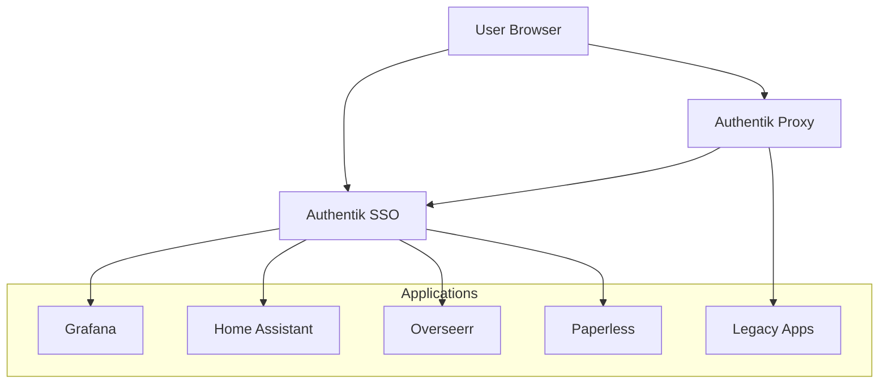

# 🔐 SSO Setup Guide - Authentik

Setting up Single Sign-On (SSO) with Authentik can be complex but provides centralized authentication for all your homelab services. This guide walks through the complete setup process.

## 📋 Overview

### What is Authentik?

Authentik is an open-source Identity Provider (IdP) that provides:

- **Single Sign-On (SSO)** for all applications
- **Multi-Factor Authentication (MFA)**
- **User and Group Management**
- **OAuth2, SAML, LDAP** protocol support
- **Forward Auth** for applications without native auth

### Architecture



## 🚀 Initial Authentik Setup

### 1. Access Authentik Admin Interface

```bash
# Check Authentik deployment
kubectl get pods -n security | grep authentik

# Get admin password (stored in 1Password)
kubectl get secret -n security authentik-secret -o jsonpath='{.data.admin-password}' | base64 -d
```

Access: `https://auth.your-domain.com/if/admin/`

### 2. Initial Configuration

#### Create Admin User

1. **Navigate to**: Directory → Users
2. **Create User**:
   - Username: `admin`
   - Email: `your-email@domain.com`
   - Name: `Administrator`
   - Groups: `authentik Admins`
   - Set strong password

#### Configure Branding

1. **Navigate to**: System → Brands
2. **Edit default brand**:
   - Title: `Your Homelab`
   - Branding title: `Homelab SSO`
   - Logo: Upload your logo (optional)
   - Domain: `auth.your-domain.com`

## 🏢 User and Group Management

### Create User Groups

#### 1. Administrators Group

```yaml
Name: Homelab Admins
Attributes:
  homelab_admin: true
  full_access: true
```

#### 2. Family Members Group

```yaml
Name: Family
Attributes:
  homelab_user: true
  media_access: true
  monitoring_read: true
```

#### 3. Media Users Group

```yaml
Name: Media Users
Attributes:
  media_access: true
  download_access: true
```

### Create Users

For each user:

1. **Navigate to**: Directory → Users → Create
2. **Fill in details**:
   - Username: `username`
   - Email: `user@domain.com`
   - Name: `Full Name`
   - Groups: Assign appropriate groups
3. **Set password** or send enrollment invitation

## 🔧 Application Integration

### OAuth2/OIDC Applications

#### 1. Grafana Integration

**Create Provider:**

1. **Navigate to**: Applications → Providers → Create
2. **Provider Type**: OAuth2/OpenID Provider
3. **Configuration**:

   ```yaml
   Name: Grafana Provider
   Authorization flow: explicit-consent (recommended)
   Client type: Confidential
   Client ID: grafana
   Client Secret: [Generate random secret]
   Redirect URIs: https://grafana.your-domain.com/login/generic_oauth
   Signing Key: [Use default]
   ```

**Create Application:**

1. **Navigate to**: Applications → Applications → Create
2. **Configuration**:

   ```yaml
   Name: Grafana
   Slug: grafana
   Provider: Grafana Provider
   Meta Launch URL: https://grafana.your-domain.com
   ```

**Configure Grafana:**
Update Grafana's helm values:

```yaml
grafana:
  grafana.ini:
    auth.generic_oauth:
      enabled: true
      name: Authentik
      client_id: grafana
      client_secret: [your-secret]
      scopes: openid profile email
      auth_url: https://auth.your-domain.com/application/o/authorize/
      token_url: https://auth.your-domain.com/application/o/token/
      api_url: https://auth.your-domain.com/application/o/userinfo/
      allow_sign_up: true
      role_attribute_path: contains(groups[*], 'Homelab Admins') && 'Admin' || 'Viewer'
```

#### 2. Overseerr Integration

**Create Provider:**

```yaml
Name: Overseerr Provider
Client ID: overseerr
Client Secret: [Generate random secret]
Redirect URIs: https://overseerr.your-domain.com/api/v1/auth/oidc-callback
```

**Configure Overseerr:**

1. **Navigate to**: Overseerr → Settings → General
2. **Authentication Method**: Use your Authentik settings
3. **OIDC Configuration**:
   - Issuer URL: `https://auth.your-domain.com/application/o/overseerr/`
   - Client ID: `overseerr`
   - Client Secret: `[your-secret]`

### Forward Auth for Legacy Applications

#### 1. Create Proxy Provider

**Create Provider:**

1. **Navigate to**: Applications → Providers → Create
2. **Provider Type**: Proxy Provider
3. **Configuration**:

   ```yaml
   Name: Forward Auth Provider
   Authorization flow: implicit-consent
   External host: https://your-legacy-app.your-domain.com
   Internal host: http://legacy-app-service.namespace.svc.cluster.local:port
   ```

**Create Outpost:**

1. **Navigate to**: Applications → Outposts → Create
2. **Configuration**:

   ```yaml
   Name: Forward Auth Outpost
   Type: Proxy
   Providers: Forward Auth Provider
   ```

#### 2. Configure Ingress with Forward Auth

```yaml
apiVersion: networking.k8s.io/v1
kind: Ingress
metadata:
  name: legacy-app
  annotations:
    nginx.ingress.kubernetes.io/auth-url: http://authentik-proxy.security.svc.cluster.local:9000/outpost.goauthentik.io/auth/nginx
    nginx.ingress.kubernetes.io/auth-signin: https://auth.your-domain.com/outpost.goauthentik.io/start?rd=$escaped_request_uri
    nginx.ingress.kubernetes.io/auth-response-headers: Set-Cookie,X-authentik-username,X-authentik-groups,X-authentik-email,X-authentik-name,X-authentik-uid
    nginx.ingress.kubernetes.io/auth-snippet: proxy_set_header X-Forwarded-Host $http_host;
spec:
  tls:
    - hosts: [legacy-app.your-domain.com]
      secretName: legacy-app-tls
  rules:
    - host: legacy-app.your-domain.com
      http:
        paths:
          - path: /
            pathType: Prefix
            backend:
              service:
                name: legacy-app
                port: {number: 80}
```

## 🔒 Multi-Factor Authentication (MFA)

### Enable MFA for Admin Users

1. **Navigate to**: Flows & Stages → Stages → Create
2. **Stage Type**: Authenticator Validation Stage
3. **Configuration**:

   ```yaml
   Name: MFA Validation
   Device classes: TOTP, WebAuthn, Static tokens
   ```

### Create MFA Flow

1. **Navigate to**: Flows & Stages → Flows → Create
2. **Configuration**:

   ```yaml
   Name: Admin MFA Flow
   Title: Admin Multi-Factor Authentication
   Designation: authentication
   ```

3. **Add Stages**:
   - User Login Stage
   - MFA Validation Stage (conditional: user in "Homelab Admins" group)

### Assign MFA Flow

1. **Navigate to**: Applications → Applications
2. **Edit each admin application**
3. **Authentication flow**: Select "Admin MFA Flow"

## 📱 User Enrollment and Management

### Create User Enrollment Flow

1. **Navigate to**: Flows & Stages → Flows
2. **Edit**: Default enrollment flow
3. **Customize stages**:
   - Email validation
   - User details capture
   - Password setup
   - Group assignment (automatic based on email domain)

### Invitation System

```bash
# Create user invitation
kubectl exec -n security deployment/authentik-server -- \
  ak create_user \
  --username newuser \
  --email newuser@domain.com \
  --send-invitation
```

## 🔧 Troubleshooting Common Issues

### Authentication Failures

**Check Authentik logs:**

```bash
kubectl logs -n security deployment/authentik-server --tail=100
kubectl logs -n security deployment/authentik-worker --tail=100
```

**Common issues:**

- **Wrong redirect URI**: Must match exactly in provider config
- **Clock skew**: Ensure all systems have correct time
- **SSL certificate issues**: Verify cert-manager certificates

### Application Integration Issues

**Grafana not redirecting:**

```bash
# Check Grafana configuration
kubectl get configmap -n observability grafana-config -o yaml

# Verify OAuth2 settings match Authentik provider
```

**Forward auth not working:**

```bash
# Check authentik-proxy logs
kubectl logs -n security deployment/authentik-proxy --tail=50

# Verify ingress annotations
kubectl describe ingress -n <namespace> <app-name>
```

### User Access Issues

**Check user groups and permissions:**

1. **Navigate to**: Directory → Users
2. **Select user** → Groups tab
3. **Verify group membership**

**Check application policies:**

1. **Navigate to**: Applications → Applications
2. **Select application** → Policy / Group / User Bindings

## 📊 Monitoring SSO

### Authentik Metrics

**Enable Prometheus metrics:**

```yaml
# In Authentik helm values
authentik:
  env:
    AUTHENTIK_PROMETHEUS_METRICS: "true"
```

**Key metrics to monitor:**

- Authentication success/failure rates
- User session counts
- Application access patterns
- MFA usage statistics

### Grafana Dashboard

Import Authentik dashboard:

1. **Navigate to**: Grafana → Dashboards → Import
2. **Dashboard ID**: 14837 (Authentik dashboard)
3. **Configure data source**: Prometheus

### Alerting Rules

```yaml
# High authentication failure rate
- alert: AuthentikHighAuthFailures
  expr: rate(authentik_auth_requests_total{status="failed"}[5m]) > 0.1
  for: 2m
  labels:
    severity: warning
  annotations:
    summary: High authentication failure rate in Authentik

# User account lockouts
- alert: AuthentikAccountLockouts
  expr: increase(authentik_user_lockouts_total[1h]) > 5
  for: 0m
  labels:
    severity: critical
  annotations:
    summary: Multiple user account lockouts detected
```

## 🚀 Advanced Configuration

### Custom Themes

**Create custom CSS:**

```css
/* Custom Authentik theme */
:root {
  --ak-primary: #your-primary-color;
  --ak-primary-hover: #your-hover-color;
}

.ak-brand img {
  max-height: 48px;
}
```

**Apply theme:**

1. **Navigate to**: System → Brands
2. **Edit brand** → Attributes
3. **Add**: `theme_css: [your-css-content]`

### API Integration

**Create service account:**

```bash
# Generate API token for automation
kubectl exec -n security deployment/authentik-server -- \
  ak create_token \
  --identifier automation \
  --description "Automation token" \
  --expires-in 365
```

### Backup Configuration

**Export Authentik configuration:**

```bash
# Export all Authentik configuration
kubectl exec -n security deployment/authentik-server -- \
  ak export > authentik-backup.json
```

**Restore configuration:**

```bash
# Import configuration
kubectl exec -n security deployment/authentik-server -- \
  ak import authentik-backup.json
```

## ✅ Post-Setup Checklist

### Security Verification

- [ ] Admin accounts have MFA enabled
- [ ] Default passwords changed
- [ ] API tokens secured in 1Password
- [ ] Backup configuration exported
- [ ] SSL certificates valid and renewed

### Application Integration

- [ ] Grafana SSO working
- [ ] Overseerr authentication configured
- [ ] Forward auth protecting legacy apps
- [ ] User permissions tested
- [ ] Group memberships verified

### Monitoring

- [ ] Authentik metrics in Prometheus
- [ ] Grafana dashboard imported
- [ ] Alert rules configured
- [ ] Log aggregation setup

---

**💡 Pro Tips:**

- Test SSO integration in a staging environment first
- Keep a local admin account as backup access
- Document all client secrets in 1Password
- Regular backup of Authentik configuration
- Monitor authentication logs for suspicious activity

**Next Steps:**

- [Application Management](./application-management.md) - Managing SSO-enabled services
- [Monitoring Setup](./monitoring.md) - Configure SSO monitoring and alerting
